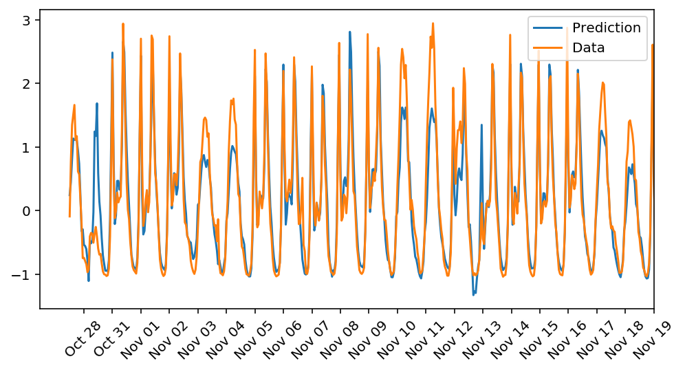

Using only Numpy & Pandas to implement forward and back propagation to predict Bike-Sharing Patterns.

The data comes from: [UCI Machine Learning Database](https://archive.ics.uci.edu/ml/datasets/Bike+Sharing+Dataset)
## Conclusions

